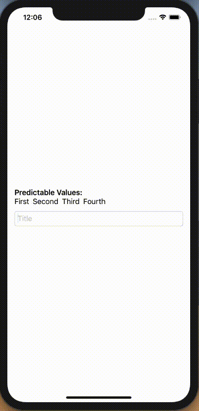

# Live TextField Input Prediction

## Simple Swift ```TextField``` Live Input Prediction
This is an approach to get live input predictions/ auto completion of a SwiftUI ```TextField```

### How to use:
Copy the file ```PredictingTextField.swift``` into your Project and use it by calling a
```PredictingTextField(...)```. 
You can and need to pass it the following variables: 

#### Mandatory
1) ```predictableValues``` -> ```@Binding Array<String>``` Needs to be an Array of Strings as we compare the input of the ```TextField``` which also is a String to these Strings. It can be only one Item in the Array or an empty array. In the later case the ```TextField``` will not make any predictions and the use of a normal ```TextField``` is recommended. 
2) ```predictedValues``` -> ```@Binding Array<String>``` This also needs to be an Array of Strings. Should be empty when initialized. In here will be the prediction/ -s of the input of the ```TextField``` based on the *predictableValues*. It is given as attribute so the predictions can be accessed on the parent view.
3) ```textFieldInput``` -> ```@Binding String``` This is the text that is currently in the ```TextField``` (This is a parameter that is also used in the Swift implementation of ```TextField```() ). It is provided as Binding Object so it can be reset from the parent view. If e.g. one wants to reset the input of the ```TextField``` once a prediction was made/ selected/ used.

#### Optinal
4) ```textFieldTitle``` -> ```@State Double?``` This can be modified to accelerate or slower the prediction. Default is a predicition made every 0.1 seconds.
5) ```predictionInterval``` -> ```@State String?``` Use this to set a Title in an untouched ```TextField```

Note: If the ```TextField``` gets multiple inputs at once. E.g. in form of a String separated by *spaces* it will make predictions on every SubString of that input and append these predictions to the *predictedValues* Array. **Altough every prediction will only occure once in the ```predictedValues```**.

### E.g. of use


